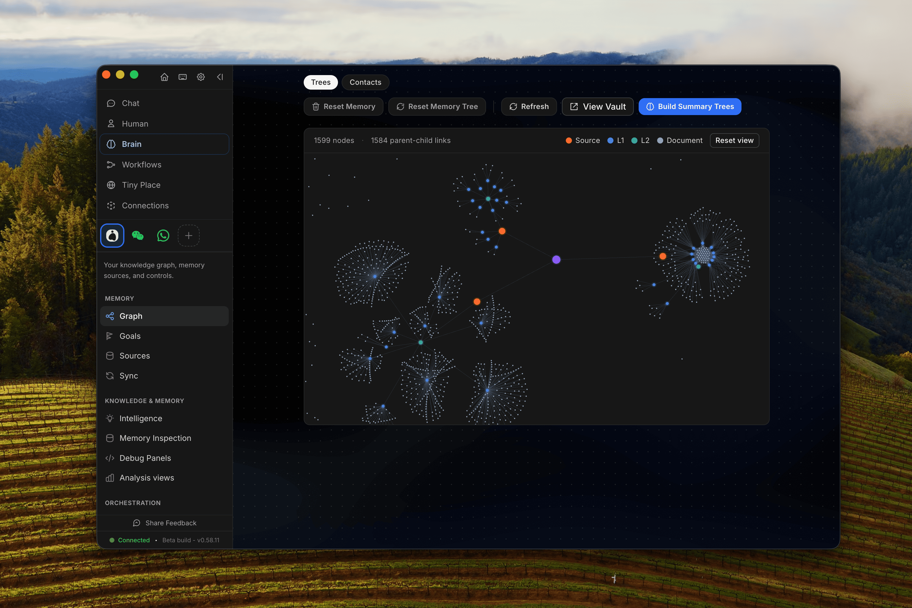

# Memory

<figure><figcaption><p>A preview of the OpenHuman memory in Obsidian. Data from various sources (GMail, Slack, Whatsapp etc..) is organized as a memory tree.</p></figcaption></figure>

OpenHuman's memory is not a black box. The same chunks the agent reasons over are written as plain `.md` files into an Obsidian-compatible vault inside your workspace. You can open it in [Obsidian](https://obsidian.md), browse it, edit it, and link notes by hand, and the agent will see your edits.

The design is directly inspired by [Andrej Karpathy's obsidian-wiki workflow](https://x.com/karpathy/status/2039805659525644595): a personal wiki where every interesting thing in your life ends up as a linkable note.

## In this section

The memory system spans several layers. This page covers the on-disk vault; the rest of the section goes deeper:

| Page                                          | What it covers                                                                              |
| --------------------------------------------- | ------------------------------------------------------------------------------------------- |
| [Memory Tree](memory-tree.md)                 | The hierarchical summary forest (L0 buffers → summaries → digests) that produces the vault. |
| [Memory Sources & Scoping](sources.md)        | The typed registry of connectors that feed memory, and per-agent source allowlisting.       |
| [Auto-fetch from Integrations](auto-fetch.md) | The 20-minute sync loop that keeps memory fresh on its own.                                 |
| [Scoring & Ranking](scoring.md)               | How chunks are admitted, enriched with entities, and indexed for recall.                    |
| [Retrieval & Recall](retrieval.md)            | The `memory_tree` tool modes the agent uses to read memory back.                            |
| [Memory Diff (Git-Backed)](memory-diff.md)    | A git ledger of how memory changes over time: "what's new since I last looked."             |
| [agentmemory backend](agentmemory-backend.md) | Optional shared `agentmemory` store across other coding agents.                             |

## Where the vault lives

```
<workspace>/
└── wiki/
 ├── summaries/ # auto-generated source / topic / global summaries
 ├── notes/ # your hand-written notes (free-form)
 └── … # one folder per connected toolkit you've connected
```

The `summaries/` folder is laid out hierarchically, by date for the global tree, by source for source trees, by entity for topic trees. Each file's frontmatter carries provenance (source ids, time range, scope) so the agent can trace any claim back to the chunks that produced it.

## Open the vault

In the desktop app, the **Memory** tab has a **"View vault in Obsidian"** button. It uses an `obsidian://open?path=...` deep link, which only resolves once the folder is **registered** as a vault in Obsidian. The deep link can't register it for you. So the first time:

1. Click **View vault in Obsidian**. If the folder isn't a registered vault yet, OpenHuman shows inline guidance instead of silently failing.
2. In Obsidian, choose **"Open folder as vault"** and pick the path shown. You only need to do this once.
3. Click **View vault in Obsidian** again; it now opens straight into the vault.

If Obsidian is installed somewhere non-standard (Flatpak/Snap/portable), use **Open in Obsidian anyway**, or point OpenHuman at its config folder under **Advanced** so detection works. Don't have Obsidian? The guidance links to the download page, and **Reveal Folder** always opens the vault directory in your OS file manager.

You can also open the folder in any editor, it's just Markdown. Links between files use standard `[[wiki-link]]` syntax, so Obsidian's graph view, backlinks, and tag explorer all work out of the box.

## Editing notes by hand

Anything you put in `wiki/notes/` is fair game for ingest. The same pipeline that processes Gmail and Slack picks up your hand-written notes, chunks them, scores them, and folds them into the topic and global trees alongside everything else.

This means you can:

- Drop a meeting note in `wiki/notes/2026-05-08-board-call.md` and the agent will know the context tomorrow.
- Maintain a file per project, per person, per ticker, the topic tree treats your manual notes as just another source.
- Bulk-import an existing Obsidian vault: drop the `.md` files in and trigger ingest.

## Why this matters

You can't trust a memory you can't read. Most "AI memory" systems hide the state in opaque embeddings; OpenHuman's vault is the inverse, the agent's memory is **literally** a folder of Markdown you own. If the agent gets something wrong, you can find the file, fix it, and the next retrieval is correct.

It's also the cleanest possible export: stop using OpenHuman tomorrow and you keep a fully-formed personal wiki.

## See also

- [Memory Tree](memory-tree.md). the pipeline that produces the vault.
- [Auto-fetch from Integrations](auto-fetch.md). how the vault grows on its own.
